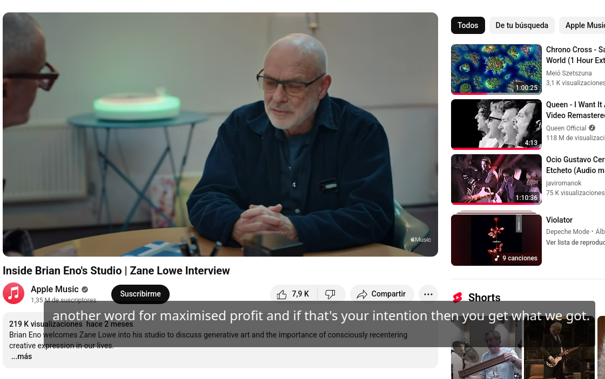

# A Real time Qt Interface for Whisper.cpp 

A Qt application based on whisper.cpp/examples/stream. The goal its to have a real time transcription (as subtitles)
of audio output (any app, like youtube, video calls). 

Its recommended to have CUDA and nvidia driver installed, for Real time performance.
The project its at early stages. Its alpha version. Its tested on Linux+KDE. 

To allow the app to get focus, you must go:

System Settings -> Window Behavior-> Focus

* Disable: Click raises active window

In general terms, do you need to make capable that any application can obtain focus, without need of click.

For now the application get focus for every transcription, you cannot hold keyboard focus. This its
functional for a interview when not its need to use desktop actively.

### Example

The application looks like it. A semi-transparent text over the screen.

## Instructions

### Install dependencies
#### Install CUDA and NVIDIA driver
https://developer.nvidia.com/cuda-downloads
#### Install SDL2

On Debian based linux distributions:
* sudo apt-get install libsdl2-dev

On Fedora Linux:
* sudo dnf install SDL2 SDL2-devel

Install SDL2 on Mac OS
* brew install sdl2

Whisper.cpp its handled by the CMake project.

### Build the CMake project and build the source.
### Download model
sh ./extern/whisper.cpp/models/download-ggml-model.sh base.en
### create virtual mic with pulse-audio

* pactl load-module module-remap-source     master=alsa_output.usb-Antelope_Audio_ZenGoSC_4501823000211-00.multichannel-output.monitor     source_name=virtmic     source_properties=device.description=Virtual_Microphone

replace master device with our device, use "pactl list short sinks". Put .monitor as suffix.

### Check available mics

use tool sdl_mics at project. Take the number of virtual microphone. 

### Start

run the application by "./QRTWhisper [n]", where n its the virtual mic device.
for example "./QRTWhisper 1"

### Roadmap

* Improve interfacing for avoid lost of keyboard focus.
* add mic managment at app, and other settings, to make it working out-fox-the-box.
* add other methods for show transcriptions, for example a Android app. 
* create builds for specific CUDA version and platforms (Linux, Windows, MCOS).

### Support it!

You can sponsor the project. Its helps the growth. 

USDT via TRC20:

TFPJT5d3aBoWcPDCGf241MZUen3E9htd23

